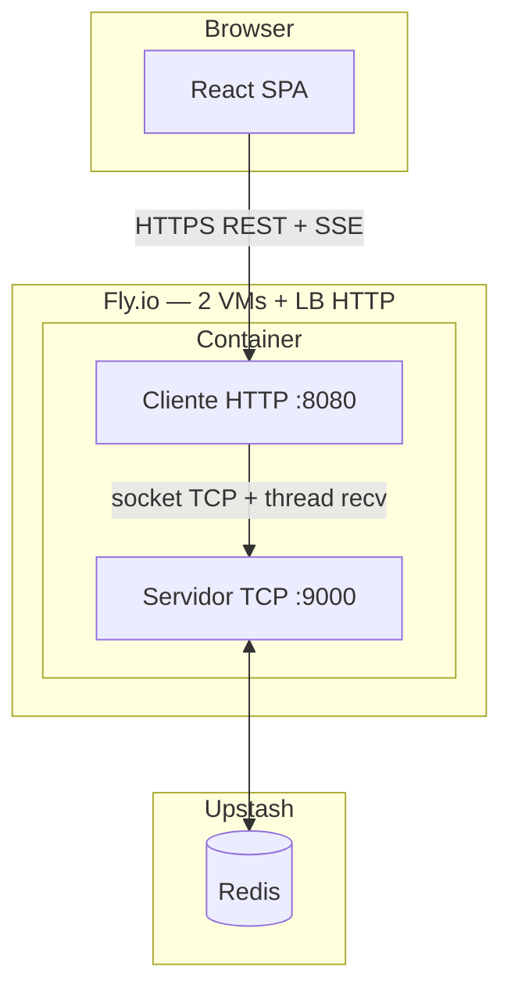

# Arquitetura do sistema

## Visão geral



## Papéis

| Componente | Pacote | Função |
|------------|--------|--------|
| **Cliente** | `client/` | Servidor HTTP embutido para o navegador; uma thread `socket-recv-<user>` por usuário; envia/recebe frames TCP |
| **Servidor** | `server/` | Aceita conexões TCP; **uma thread `ClientSession` por conexão**; persiste e faz broadcast via Redis |
| **Estado** | Upstash Redis | Histórico, sessões, pub/sub entre réplicas |
| **Infra** | Fly.io × 2 | Load balancer HTTP na porta do **cliente**; failover se uma VM cair |

## Fluxo de uma mensagem

1. Usuário envia texto no React → `POST /messages` (HTTP → **cliente**).
2. Cliente encaminha frame `{"type":"message","text":"..."}` no **socket TCP**.
3. Servidor valida sessão, grava no Redis, publica no canal pub/sub.
4. Todas as instâncias servidor recebem pub/sub e enviam frame `chat` aos TCP conectados.
5. Thread **recv** de cada cliente recebe o frame → fila SSE → navegador via `GET /events`.

Todas as mensagens passam pelo **servidor** antes de chegar aos demais.

## Threads (requisito acadêmico)

| Local | Mecanismo |
|-------|-----------|
| Servidor | `ClientSession(threading.Thread)` — uma thread por conexão TCP |
| Cliente | `SocketBridge` — `threading.Thread(target=_recv_loop, name="socket-recv-<user>")` |
| Servidor (réplicas) | Thread `redis-pubsub` para fan-out entre VMs |
| Navegador | `EventSource` (API do browser sobre HTTP; não é WebSocket) |

## Failover e afinidade de sessão

Com 2 VMs, o proxy mantém o TCP **na memória da VM que fez login**. O load balancer HTTP precisa enviar todas as requisições do mesmo usuário para a mesma máquina:

- Cookie `fly_machine_id` + header `fly-force-instance-id` (front)
- Redis `proxy:affinity:<session_id>` + middleware `fly-replay` (back)
- `replay_cache` no `fly.toml`

Se a VM cair, o usuário faz login de novo (nova VM). `GET /history?since=` recupera mensagens perdidas após reconexão SSE.

## Estrutura do repositório

```text
distributed-chat/
├── client/       # Cliente (HTTP + TCP)
├── server/       # Servidor de chat TCP
├── stack/        # python -m stack (produção)
├── frontend/     # React
├── common/       # Protocolo NDJSON
└── docs/
```

## Execução

| Modo | Comando |
|------|---------|
| Produção / Docker | `python -m stack` |
| Só servidor (dev) | `python -m server` |
| Só cliente (dev) | `python -m client` |
