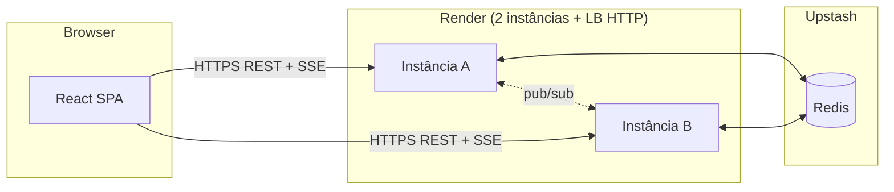

# Arquitetura — chat 100% web

## Visão geral

| Camada | Tecnologia | Papel |
| --- | --- | --- |
| Front-end | React (Vite), servido pelo mesmo deploy | UI no navegador — **zero instalação** |
| API | FastAPI + Uvicorn | `POST /login`, `POST /messages`, `GET /events` (SSE) |
| Concorrência | `threading` | Uma thread por conexão TCP (opcional); pub/sub Redis em thread dedicada; SSE bloqueia em `Queue.get` por cliente |
| Estado | Redis (Upstash) | Histórico, sessões web, pub/sub entre instâncias |
| Infra | Render Web Service × 2 | Load balancer HTTP nativo |

## Fluxo de login

1. Navegador `POST /login` com `username`.
2. Instância cria `session_id` no Redis (TTL 5 min, renovável).
3. Resposta `welcome` inclui `history`.
4. Front guarda `session_id` em `localStorage`.

## Fluxo de mensagem

1. `POST /messages` com header `X-Session-Id`.
2. Servidor grava em `chat:history` e publica no canal pub/sub.
3. Todas as instâncias recebem o evento e enviam às filas SSE locais.

## Failover (professor derruba uma instância)

1. SSE da instância morta cai → navegador reconecta (outra instância via LB).
2. Mesmo `session_id` no Redis → usuário continua autenticado.
3. Front chama `GET /history?since=...` e recupera mensagens perdidas.
4. Banner discreto: “Conexão restabelecida”.
5. **Sem logout**, sem perder username, sem reinstalar nada.

## Pasta `client/` (legado)

O proxy local (`client/`) permanece no repositório para desenvolvimento e referência acadêmica (thread `recv` + ponte HTTP), mas **não é necessário** na demonstração em aula.

## Pasta `server/`

- `main.py` — entrada unificada HTTP + TCP opcional
- `http_app.py` — rotas web
- `chat_core.py` — regras de negócio
- `session.py` — clientes TCP nativos (opcional)
- `redis_service.py` — persistência e pub/sub
