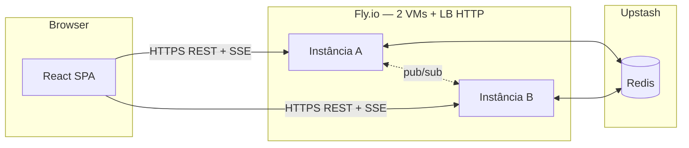

# Arquitetura do sistema

## Visão geral



| Camada | Tecnologia | Papel |
| --- | --- | --- |
| Front-end | React (Vite), servido pelo mesmo container | UI — **zero instalação** |
| API | FastAPI + Uvicorn (`server/`) | Login, mensagens, SSE |
| Estado | Redis (Upstash) | Histórico, sessões, pub/sub |
| Infra | Fly.io × 2 (`fly scale count 2`) | Load balancer HTTP |

## Fluxo de dados

1. Navegador carrega SPA em `https://app.fly.dev/`.
2. `POST /login` → sessão em Redis + histórico.
3. `GET /events?session=...` (SSE) — recepção bloqueante por conexão (`Queue.get`).
4. `POST /messages` → persiste e publica no pub/sub → todas as VMs entregam aos SSE locais.

## Failover

1. VM cai → SSE desconecta.
2. LB roteia reconexão para outra VM.
3. Mesmo `session_id` no Redis → usuário continua logado.
4. `GET /history?since=` recupera mensagens perdidas.
5. UI: *“Conexão restabelecida”*.

## Estrutura do repositório

```text
distributed-chat/
├── frontend/          # React (build → frontend/dist no Docker)
├── server/            # API HTTP, chat_core, Redis, SSE
├── common/            # Protocolo NDJSON (TCP legado)
├── legacy/client/     # Proxy local (não usado em produção)
├── Dockerfile
├── fly.toml
└── docs/
```

## Threads (requisito acadêmico)

| Componente | Mecanismo |
| --- | --- |
| Servidor TCP (opcional, `ENABLE_TCP_SERVER`) | 1 thread por conexão (`server/session.py`) |
| Pub/sub Redis | Thread dedicada (`redis-pubsub`) |
| Cliente web (SSE) | Loop bloqueante em `Queue.get` por conexão |

## Deploy

Ver [DEPLOY.md](./DEPLOY.md).
