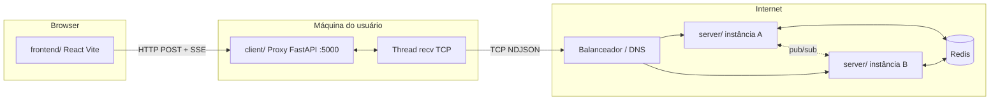

# Arquitetura do sistema

O projeto segue três camadas, conforme o enunciado acadêmico:

## Pastas e responsabilidades

| Pasta | Papel |
| --- | --- |
| `frontend/` | UI React; login, envio de mensagens, SSE para tempo real |
| `client/` | Proxy: thread de recepção TCP + API HTTP para o navegador |
| `server/` | Servidor de chat: uma thread por conexão TCP, Redis, pub/sub |
| `common/` | Serialização NDJSON e tipos de mensagem |

> O nome `client/` no Python é o **proxy intermediário** (requisito “cliente com thread de recv”). O front-end React fica em `frontend/` para evitar conflito de nomes.

## Fluxo de login

1. `IdentityScreen` → `POST /api/login` (proxy) → frame TCP `login`.
2. Servidor valida username, grava presença em Redis, responde `welcome` com `history`.
3. Proxy devolve JSON ao React; `App` monta a lista inicial de mensagens.
4. `useChatEvents` abre `EventSource` em `/api/events` para eventos posteriores.

## Fluxo de mensagem

1. `ChatScreen` → `POST /api/messages` com `{ "text": "..." }`.
2. Proxy envia frame TCP `message`.
3. Servidor persiste em `chat:history` e publica `chat` no Redis pub/sub.
4. Todas as instâncias repassam o evento aos clientes TCP locais.
5. Proxy enfileira no SSE; React acrescenta a bolha na sala global.

## Tolerância a falhas

- Estado durável no Redis (histórico e presença).
- Pub/sub replica eventos entre instâncias do `server/`.
- Reconexão TCP do proxy após queda de instância: melhoria futura; o usuário pode reiniciar o proxy.

## Desenvolvimento local

O Vite (`frontend/vite.config.ts`) faz proxy de `/api` → `http://127.0.0.1:5000`, evitando CORS em dev. O proxy também aceita origens `localhost:5173` por padrão (`client/config.py`).

## Produção (visão)

- `server/` em VM/Render/Fly com TCP público.
- `frontend/` na Vercel com `VITE_PROXY_URL` apontando para o proxy na máquina do usuário (ou túnel).
- Redis gerenciado (Upstash, Render Key Value).
