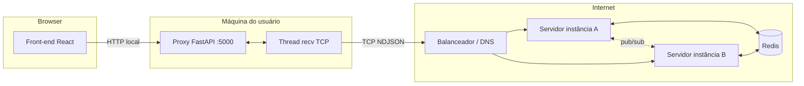

# Arquitetura do MVP (Servidor + Proxy)

Este repositório separa três papéis conceituais:

1. **Servidor de chat (TCP + threads + Redis)**: aceita conexões TCP, mantém uma thread por cliente e usa Redis para persistir histórico e replicar eventos entre instâncias (pub/sub).
2. **Proxy local (TCP + thread de recepção + HTTP)**: roda na máquina do usuário final, mantém **uma** conexão TCP com o servidor (socket nativo) e expõe uma API HTTP para o front-end (FastAPI + SSE).
3. **Front-end (React)**: desenvolvido separadamente; integra via HTTP com o proxy (`localhost` na porta configurada).

## Fluxo de dados (feliz caminho)

1. O front chama `POST /login` no proxy com `username`.
2. O proxy envia um frame `login` ao servidor via TCP.
3. O servidor valida unicidade (SET `chat:online`), devolve `welcome` com `history` e publica `user_joined` no canal Redis.
4. Todas as instâncias recebem o evento via pub/sub e fazem broadcast para **seus** clientes TCP conectados localmente.
5. O front chama `POST /messages` com o texto; o proxy envia `message` ao servidor.
6. O servidor persiste em `chat:history` (lista Redis) e publica `chat` no pub/sub; as instâncias replicam para os clientes.

## Tolerância a falhas (visão acadêmica)

- **Estado durável**: histórico e presença “global” ficam no Redis; uma nova instância pode retomar leituras consistentes do histórico.
- **Fan-out entre instâncias**: mensagens de chat e eventos de presença são propagados via Redis pub/sub, para que usuários conectados em instâncias diferentes ainda recebam os mesmos eventos.
- **Queda de instância**: conexões TCP ativas morrem com a instância; clientes (proxy) precisam reconectar. O tráfego novo deve ir para instâncias saudáveis (balanceamento + health checks na infraestrutura).

> Observação: o balanceamento de **TCP** na borda pública depende do provedor expor porta TCP com health checks adequados. No Render, ver `docs/DEPLOY_RENDER.md`.
